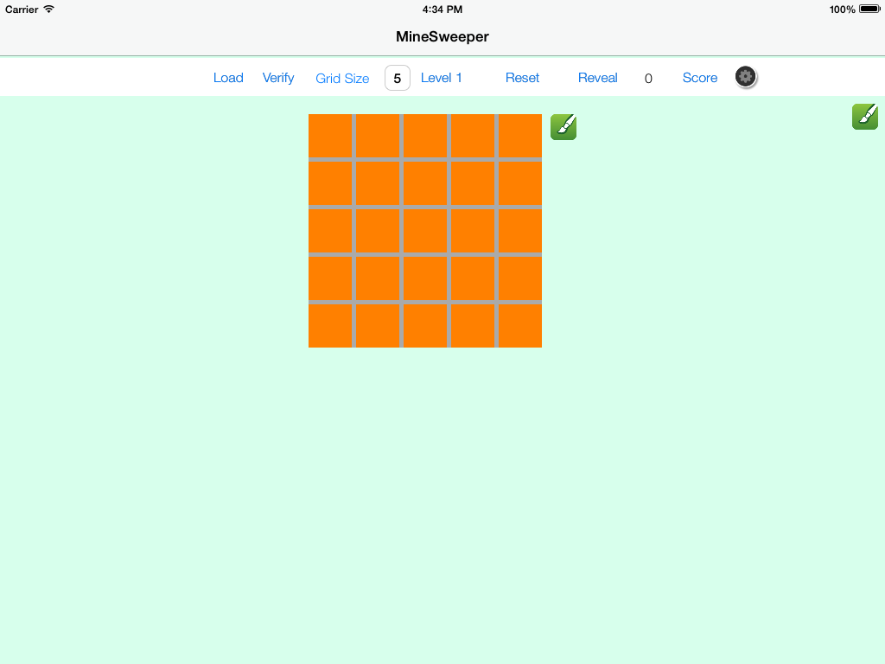
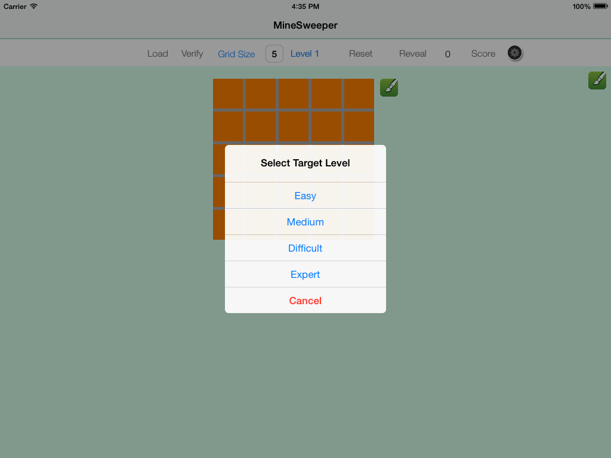
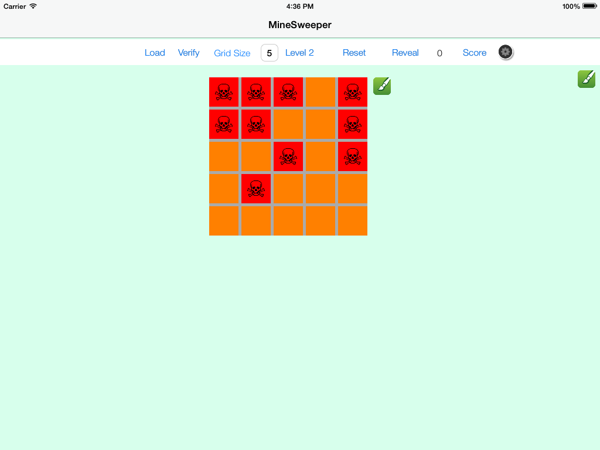
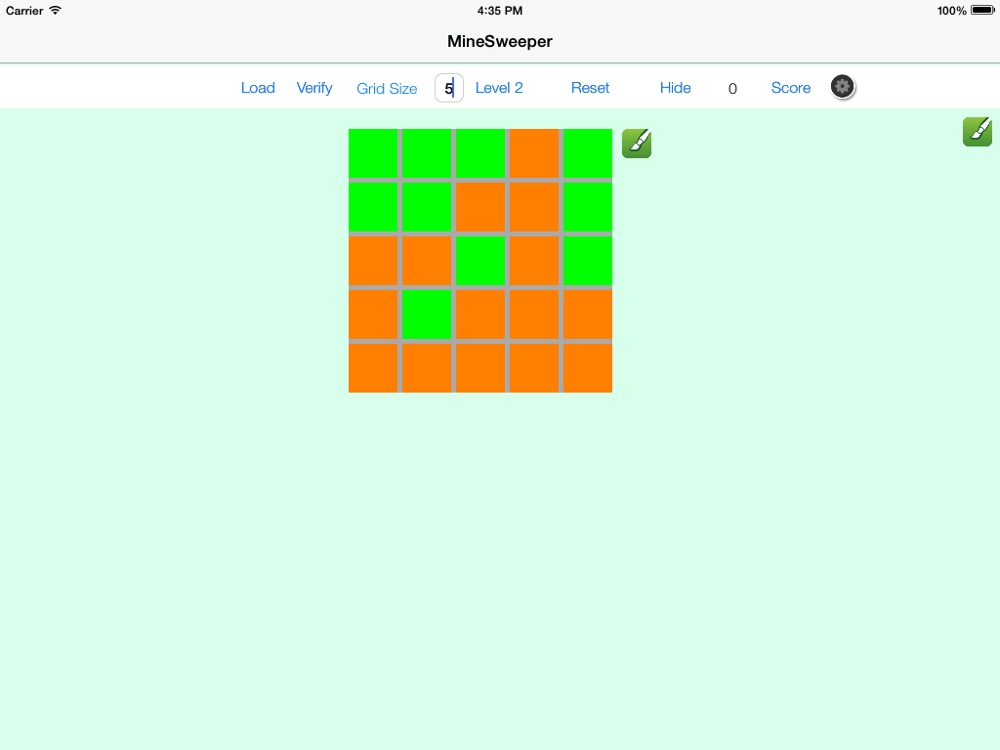
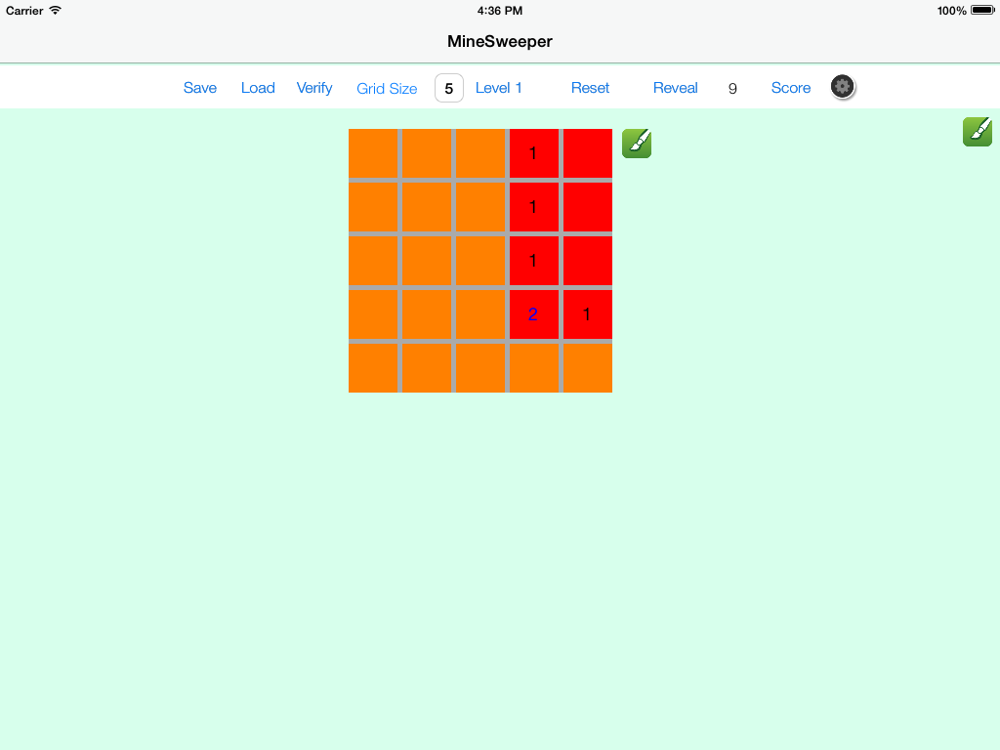
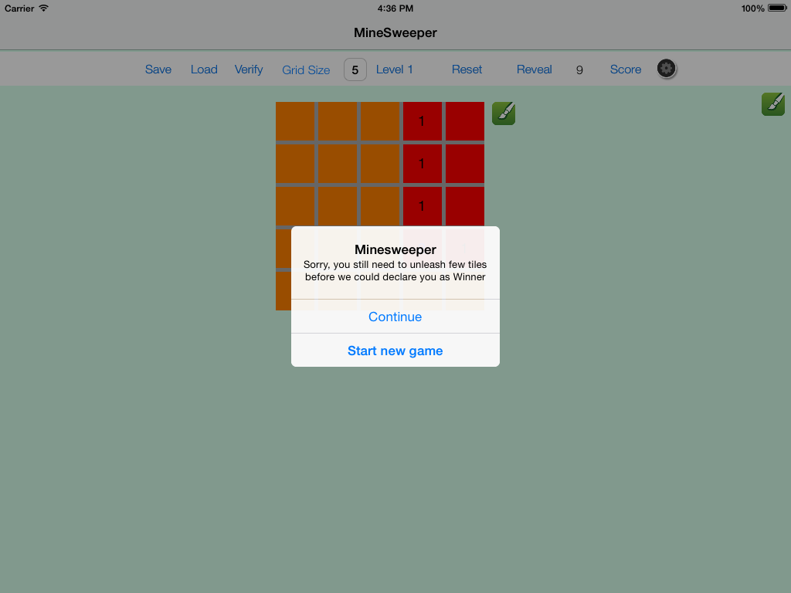
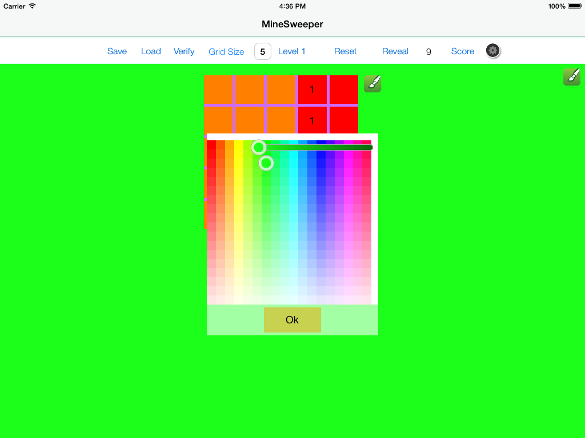
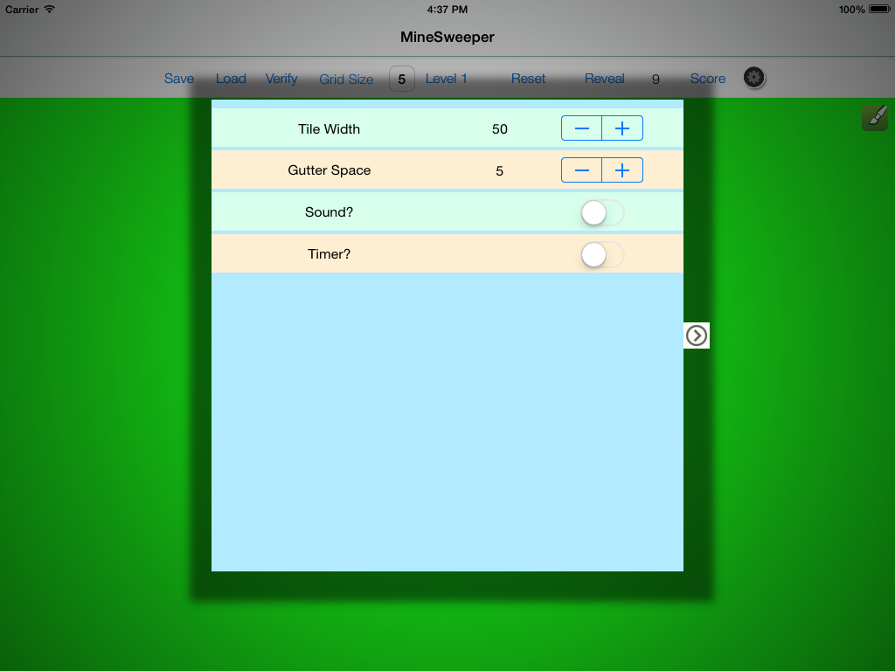

JKMineSweeperGame
=================

The implementation of classic Minesweeper using Objective-C and Cocoa

As we all played this game in the childhood, this is my honest attempt to actually create the game using 
programming language and logic. It took me couple days to write this game from scratch. But anyways, here are some of the cool screenshots for this game.

Home Page

Level Selector Options

Mines View

Revealed mines in cheat mode

Revealed tiles

Status to tell if there is a win!

Customize colors of grid and main game background

Change settings to suite to your requirement

Load previously saved game

Game follows regular Minesweeper conventions and it has following existing and additional features. I coding challenge
mentioned on [Thumbstack Challenge Page](http://www.thumbtack.com/challenges/software-engineer) motivated me to write this game.

It has following features and some of them are added in the recent version

1. Support for dynamic board generation
2. Scroll support in case board size is greater than standard iPad screen size
3. Chaet mode to reveal all mines
4. Standard scoring based on the tile revealed and stage as well
5. Choice to select difficulty level (Easy, Medium, Hard and Extreme)
6. Verify function - While game is in progress, user can click verify button any time to check if there is a win or it's still in continuation
7. Support for dynamic background color change for game board. (Courtesy of https://github.com/hayashi311/Color-Picker-for-iOS)
8. Support to view past scores
9. Support to tweak game settings (Tile size, sound and timers)
10. <b>Support to Save and Load games</b>

I used Objective-C and standard Cocoa libraries for this project.
Future additions:

1. Support for multiple devices and orientations

As usual, any critique or feature requests are welcome. If there are any bugs, let me know. I will try my best to
fix them as soon as possible.
